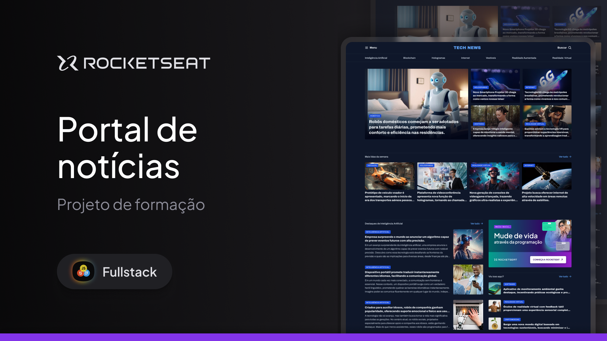

<h1 align="center"> Página de Receita </h1>

Esse projeto foi desenvolvido no curso Full Stack da Rocketseat!

  <a href="#-tecnologias">Tecnologias</a>&nbsp;&nbsp;&nbsp;|&nbsp;&nbsp;&nbsp;
  <a href="#-projeto">Projeto</a>&nbsp;&nbsp;&nbsp;|&nbsp;&nbsp;&nbsp;
  <a href="#-layout">Layout</a>&nbsp;&nbsp;&nbsp;|&nbsp;&nbsp;&nbsp;
  <a href="#memo-licença">Licença</a>

  

 

## 🚀 Tecnologias! 

Esse projeto foi desenvolvido com as seguintes tecnologias:

- HTML e CSS
- Git e Github
- Figma

## 💻 Projeto

Neste projeto, desenvolvi a homepage de um portal de notícias focado em tecnologia, utilizando HTML e CSS com foco no layout em display grid para organizar o conteúdo de forma eficiente e responsiva. A ideia foi criar uma interface limpa e moderna, com uma disposição clara das principais seções de notícias, categorias e artigos populares, ideal para ser visualizada em desktops.

## 🔖 Layout

Você pode visualizar o layout do projeto através [DESSE LINK](https://www.figma.com/design/f0MONkzD0oayXCuj0YUL1m/Portal-de-not%C3%ADcias-(Community)?m=auto&t=GpLw3mrFhjfIviSU-6). É necessário ter conta no [Figma](https://figma.com) para acessá-lo.

## 🌌 Ver Site 
Confira aqui:https://luisfelipets17.github.io/TechBox/

## :memo: Licença

Esse projeto está sob a licença MIT.

---